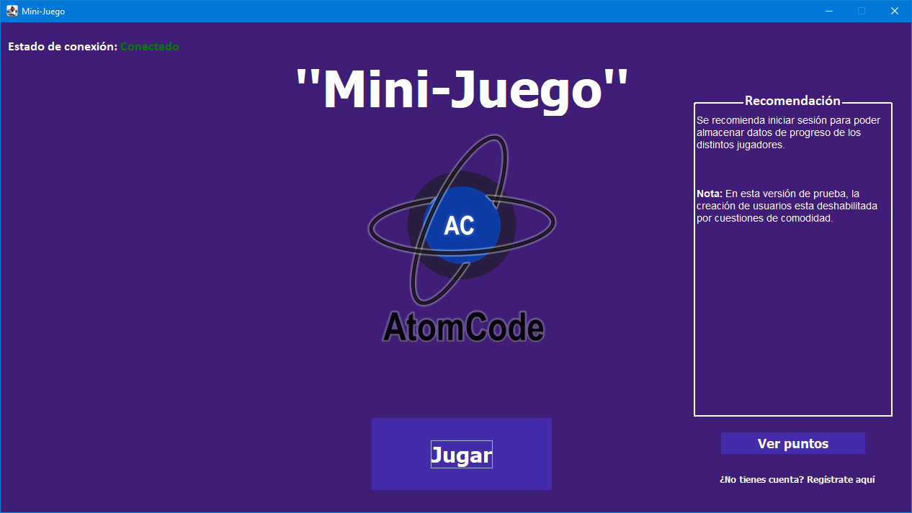
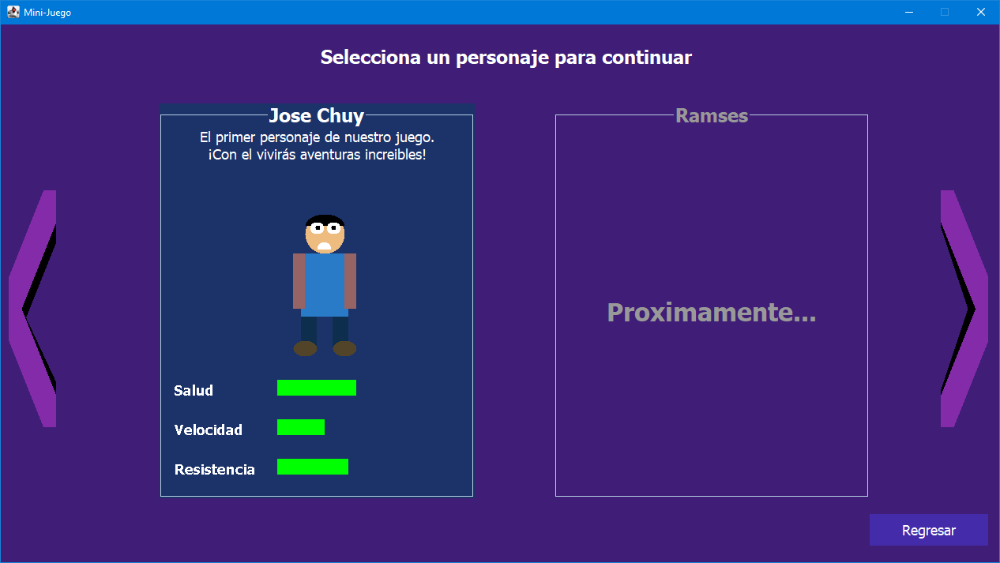
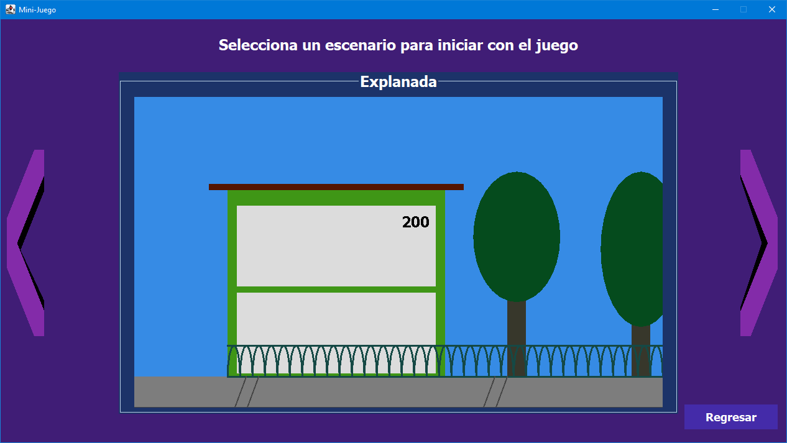
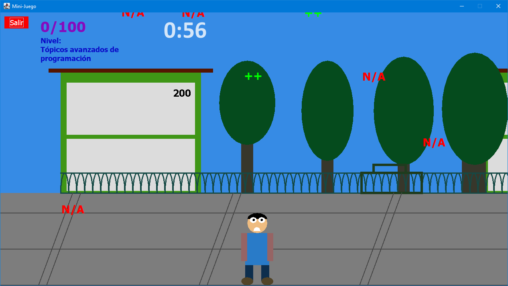
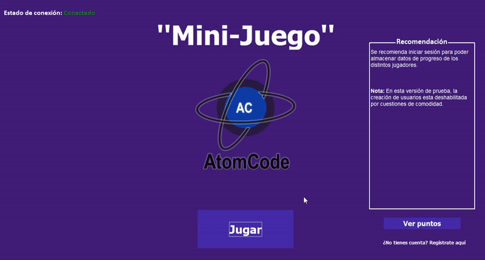
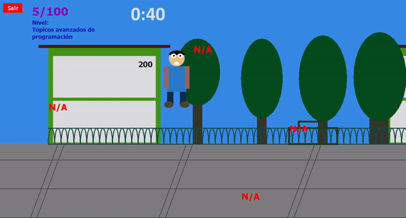

# MiniJuego
Este proyecto tiene el propósito ser entregado como proyecto final en la materia de tópicos avanzados de programación. Esta desarrollado en java (en su versión 11).

Implementación de un juego sencillo desarrollado en Java, todos los gráficos mostrados han sido creados completamente con código, desde el escenario hasta el personaje. Además, el programa cuenta con una base de datos SQL embebida (SQLite) para la persistencia de datos, cabe aclarar que la base de datos se crea en memoria de manera predeterminada, esta manera facilitando el despliegue de la aplicación, una vez que se cierra el programa la base de datos es eliminada. 

La dinámica del juego es sencilla, básicamente tienes que ir acumulando la mayor cantidad de puntos tocando los iconos verdes “+”, los iconos rojos “n/a” restan puntaje, por lo que se tienen que esquivar. De manera aleatoria, cada cierto aparecerá un pequeño obstáculo “El chuy persiguiendo una gallina” en la parte inferior recorriendo toda la ventana, este obstáculo debe ser esquivado, en caso de no hacerlo “congelara” por un par de segundos la movilidad  del personaje. 

 

### Características del proyecto 
- Maven como herramienta de construcción de proyecto
- SQLite como gestor de base de datos embebido (base de datos cargada en memoria)
- Java 11

 
 

## Pantallas 

> Pantalla de inicio, nos da la posibilidad de poder registrar un usuario, ver puntuaciones guardadas en la base de datos e iniciar el juego

 
 

> Pantalla de selección del persona, nos da la posibilidad de poder seleccionar nuestro avatar que usaremos en el juego

 
 

> Pantalla de selección del escenario, nos da la posibilidad de poder cambiar los diferentes entornos donde queremos jugar

 
 

> Pantalla que muestra un nivel en progreso, en la parte superior podemos apreciar el tiempo antes de que termine el nivel, los puntos acumulados y la posibilidad de poder salir en cualquier momento

 
 

## Gameplay

En esta sección se muestra la dinámica del juego, antes de iniciar a jugar demos de seleccionar un avatar, posteriormente seleccionamos un escenario y ahora podremos iniciar la partida. Hasta el momento solamente se han desarrollado un único avatar y escenario para ser seleccionados, pero se espera que en algún futuro se incorporen más (o no).

La dinámica del juego es sencilla, básicamente tienes que acumular la mayor cantidad de puntos atrapando los iconos verdes, los iconos rojos restan puntaje y además hay que esquivar un obstáculo en la parte inferior que aparece de manera aleatoria cada cierto tiempo. Tienes un minuto para acumular la mayor cantidad de puntos. 

 

>  Demostración de la selección del avatar del personaje y el escenario donde se llevará a cabo el juego

 
 

> Demostración del juego en curso
